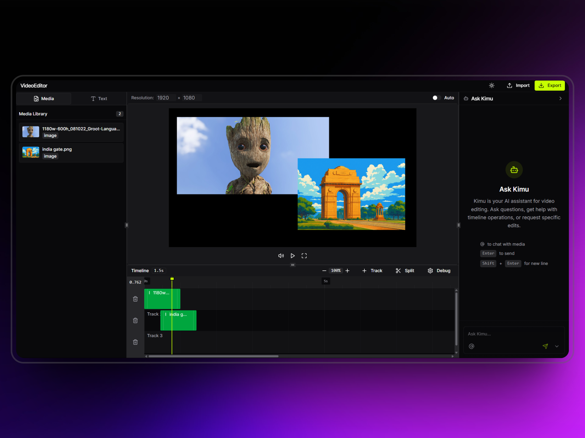

<samp>
  
<h1>Kylo</h1>
<p>Copilot for Video Editing.</p>
<br />

> [!NOTE]  
> The application is under active development. This is an early MVP. Please join the [Discord server](https://discord.gg/GSknuxubZK) if you're going to run it.

<br />

<p align="center">
  
</p>
<p align="center">An open-source alternative to Capcut, Canva, and RVE.</p>
</samp>

## ✨Features

### 🆕 NEW: Professional Effects System (Phase 2 - 100% Complete!)
- ✨ **12 GPU-Accelerated Effects** - Blur, sharpen, vignette, chroma key, noise, pixelate, edge detect, bloom, chromatic aberration, color correction, distortion, LUT
- 🎨 **Professional Color Grading** - 3-way color wheels (shadows/midtones/highlights) + RGB curves with Catmull-Rom interpolation
- 🎬 **LUT Support** - Import .cube and .3dl LUT files for professional color grading
- 💾 **Auto-Save Effects** - Automatic persistence to database with 1-second debouncing
- 🎯 **Real-Time Preview** - CSS filters for instant feedback, WebGL shaders for export quality
- 🎭 **16 Blend Modes** - Multiply, screen, overlay, add, subtract, and more
- 📊 **Effect Management** - Enable/disable, reorder, and combine multiple effects per clip

### Core Editing
- 🎬 **Non-Linear Video Editing** - Professional timeline-based editing
- 🔀 **Multi-track Support** - Unlimited video, audio, and text tracks
- ✂️ **Cut/Trim/Split/Join** - Precise clip manipulation
- 👀 **Live Preview** - Real-time playback with scrubbing
- 📤 **Export Video** - Multiple format support with platform presets
- ⏪ **Undo/Redo** - Full history management (100 levels)
- 🔍 **Zoom Controls** - Timeline zoom for precision editing

### Visual Effects & Color
- 🎨 **Color Correction & Grading** - Professional color tools (brightness, contrast, saturation, hue, exposure, highlights, shadows, temperature, tint, vibrance, gamma)
- 🎭 **Visual Effects Library** - 30+ effects including blur, sharpen, vignette, noise, grain, pixelate, glitch, distortion, mirror, kaleidoscope, edge detect, emboss, posterize, sepia, grayscale, duotone, bloom, lens flare, chromatic aberration
- 🟢 **Chroma Key/Green Screen** - Advanced color keying with tolerance and softness controls
- 🎨 **LUT Support** - Import/export color lookup tables with intensity control
- 🌈 **HDR & Wide Color Gamut** - Support for rec709, rec2020, DCI-P3 color spaces
- 🎭 **Blend Modes** - 16 blend modes (multiply, screen, overlay, add, subtract, etc.)

### Animation & Motion
- 🎯 **Keyframe Animation** - Animate any property with custom easing curves
- 🎬 **Motion Tracking** - Track objects and apply motion data
- 📹 **Video Stabilization** - Smooth handheld footage with rolling shutter correction
- 🎪 **3D Transforms** - Rotate, scale, and position in 3D space
- ⚡ **Speed/Time Remapping** - Variable speed with frame blending and optical flow
- 🎭 **Transitions** - Fade, wipe, slide, flip, iris, clock wipe with spring/linear timing

### Audio Editing
- 🎵 **Audio Effects** - Volume, fade in/out, normalize, compressor, limiter, equalizer, reverb, echo, delay, chorus, flanger, phaser, distortion, pitch shift, time stretch
- 🔇 **Noise Reduction** - Clean up audio with noise gate and de-esser
- 🎚️ **Audio Ducking** - Auto-lower music under voice
- 🎛️ **Audio Mixing** - Multi-track audio with individual controls
- 📊 **Loudness Metering** - LUFS normalization support

### Masking & Compositing
- ✂️ **Advanced Masking** - Rectangle, ellipse, polygon, bezier, text, and image masks
- 🎭 **Compositing Layers** - Layer-based compositing with blend modes
- 📐 **Adjustment Layers** - Apply effects to multiple clips at once
- 🎨 **Opacity & Feathering** - Smooth mask edges with feather control

### AI & Automation
- 🤖 **Auto Captions/Subtitles** - Speech-to-text with multiple models (Whisper, Google, Azure, AWS)
- 🎨 **Auto Color Correction** - AI-based color grading with presets
- 🎬 **Scene Detection** - Automatic scene splitting
- 🖼️ **Background Removal** - AI-powered background segmentation (U2Net, ModNet, BackgroundMattingV2)
- 🎯 **Smart Crop/Reframe** - AI-based content-aware reframing

### Workflow & Performance
- 📁 **Proxy Workflow** - Edit with low-res proxies, export in high-res
- ⚡ **GPU Acceleration** - Hardware encoding support (NVENC, QuickSync, VideoToolbox, AMF)
- 🔄 **Batch Processing** - Process multiple clips simultaneously
- 💾 **Auto-save & Recovery** - Never lose your work
- 🎯 **Timeline Markers** - Add markers, chapters, comments, and todos
- 📦 **Nested Sequences** - Compositions within compositions
- 🎨 **Templates & Presets** - Reusable compositions and effects

### Export & Platform Integration
- 📱 **Export Presets** - YouTube, Instagram, TikTok, Twitter, Facebook optimized
- 🎬 **Multiple Formats** - MP4, MOV, WebM, AVI, MKV support
- 🎥 **Multiple Codecs** - H.264, H.265, VP9, AV1, ProRes
- 🎵 **Audio Codecs** - AAC, MP3, Opus, FLAC
- 💧 **Watermark Support** - Add branding overlays
- 📊 **Metadata Management** - Tags, descriptions, custom fields
- 🔄 **Render Queue** - Background rendering with progress tracking

### UI & Customization
- ⌨️ **Custom Keyboard Shortcuts** - User-defined hotkeys
- 🎨 **Workspace Layouts** - Customizable UI (Default, Editing, Color Grading)
- 🌓 **Dark/Light Mode** - Theme support
- 📊 **Resource Monitoring** - CPU/GPU/Memory usage display
- 🎯 **Media Bin** - Organize assets with tags, ratings, and search
- 📝 **Text & Titles** - Rich text with templates (normal, glassy)
- 🎨 **Motion Graphics Templates** - Reusable animated graphics

### Advanced Features
- 🎬 **Multicam Editing** - Sync and switch between multiple camera angles
- 🌐 **Collaboration** - Real-time collaboration with version control
- 📹 **Screen Capture** - Built-in screen and webcam recording
- 🎭 **VR/360° Video** - Edit immersive video content
- 🎨 **Lens Correction** - Fix distortion and rolling shutter
- 🎯 **Frame Blending** - Smooth slow-motion with optical flow
- 🎨 **Color Matching** - Match colors between clips
- 📊 **Color Scopes** - Waveform, vectorscope, histogram, parade
- 🎬 **Timecode Support** - Professional timecode handling
- 🌍 **Multilingual Subtitles** - Import/export with translation tools

## 🎉 NEW: Phase 5 & 6 Backend Integration (95% Complete!)

**All backend integrations for Masking & Compositing and AI & Automation are now complete!**

### What's New
- ✅ **7 Backend Service Modules** (4,500+ lines) - AI services, job queue, video processing, WebGL rendering, caption export, mask rendering, preview service
- ✅ **3 API Route Files** (750+ lines) - Jobs API, previews API, caption export API
- ✅ **Complete Database Schema** (6 new tables, 12 indexes, 4 views, 4 functions)
- ✅ **Comprehensive Documentation** (6 files, 1,800+ lines)

### Quick Start
```bash
# Install dependencies
pnpm install

# Run database migration
pnpm migrate

# Test backend integration
pnpm test:backend

# Start the app
pnpm dev
```

### Documentation
- 🚀 **[DEPLOYMENT_READY.md](./DEPLOYMENT_READY.md)** - **START HERE** - Deployment guide & status
- 📖 **[FINAL_SUMMARY.md](./FINAL_SUMMARY.md)** - Complete overview
- 📊 **[INTEGRATION_STATUS.md](./INTEGRATION_STATUS.md)** - Status report
- 📖 **[PHASE5_PHASE6_README.md](./PHASE5_PHASE6_README.md)** - Phase 5 & 6 README
- ✅ **[VERIFICATION_CHECKLIST.md](./VERIFICATION_CHECKLIST.md)** - Verification checklist
- 🔧 **[MIGRATION_FIX_SUMMARY.md](./MIGRATION_FIX_SUMMARY.md)** - Migration fix details

### What Works Now (Without AI Services)
- ✅ Mask rendering (all 4 types with animation)
- ✅ WebGL real-time preview (60fps GPU-accelerated)
- ✅ Video processing (15+ FFmpeg operations)
- ✅ Caption export/import (SRT, VTT, ASS, SBV, JSON)
- ✅ Preview generation (7 types)
- ✅ Job queue system
- ✅ Mask animation with keyframes

### What Requires AI Services (Optional)
- ⏳ Auto captions (needs Whisper/Google/Azure/AWS APIs)
- ⏳ Background removal (needs U2Net/MODNet/BackgroundMattingV2)
- ⏳ Scene detection, auto color correction, smart crop

See **[BACKEND_SETUP_GUIDE.md](./BACKEND_SETUP_GUIDE.md)** for AI service deployment instructions.

---

## 🐋Deployment

```
git clone https://github.com/SoloWave-Lab/Kylo.git
cd videoeditor
docker compose up
```

## 🧑‍💻Development

```
pnpm i
pnpm run dev (frontend)
pnpm dlx tsx app/videorender/videorender.ts (backend)
uv run backend/main.py
flip `isProduction` to `false` in `/app/utils/api.ts`

You will also require a GEMINI_API_KEY if you want to use AI.
```

## 📃TODO

We have a lot of work! For starters, we plan to integrate all Remotion APIs. I'll add a proper roadmap soon. Join the [Discord Server](https://discord.com/) for updates and support.

## ❤️Contribution

We would love your contributions! ❤️ Check the [contribution guide](CONTRIBUTING.md).

## 📜License

This project is licensed under a dual-license. Refer to [LICENSE](LICENSE.md) for details. The [Remotion license](https://github.com/remotion-dev/remotion/blob/main/LICENSE.md) also applies to the relevant parts of the project.
